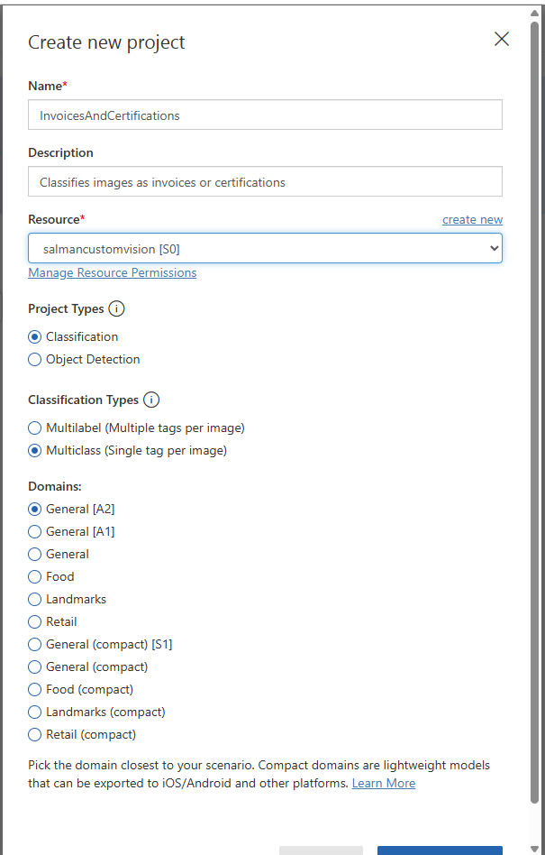
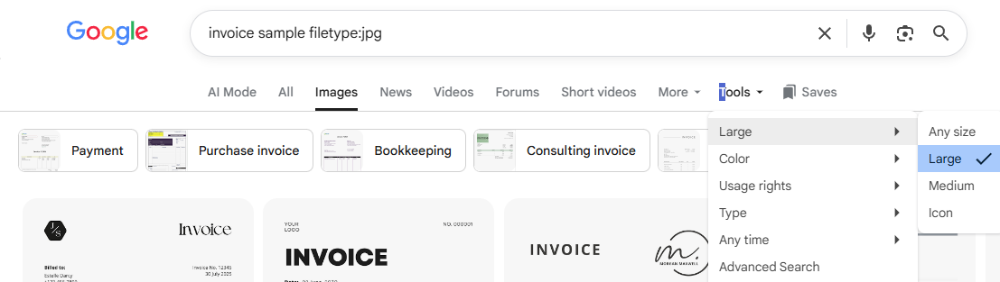
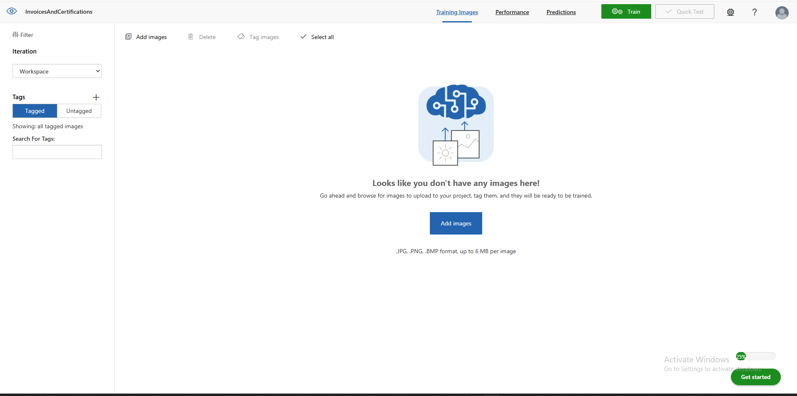
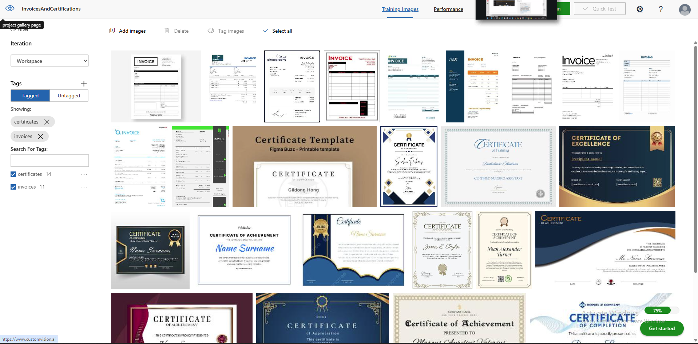
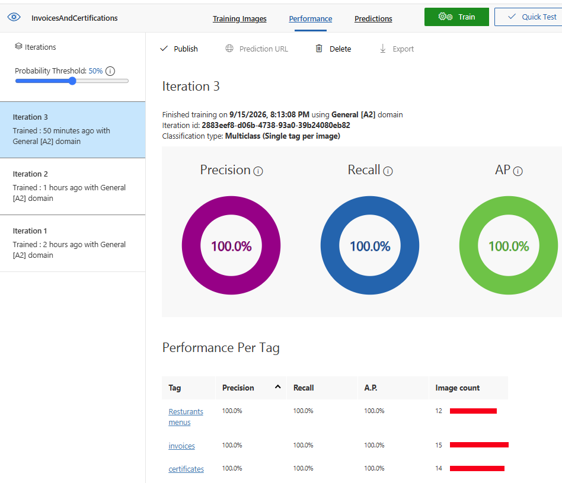
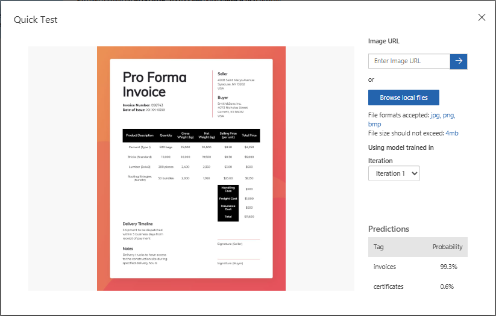
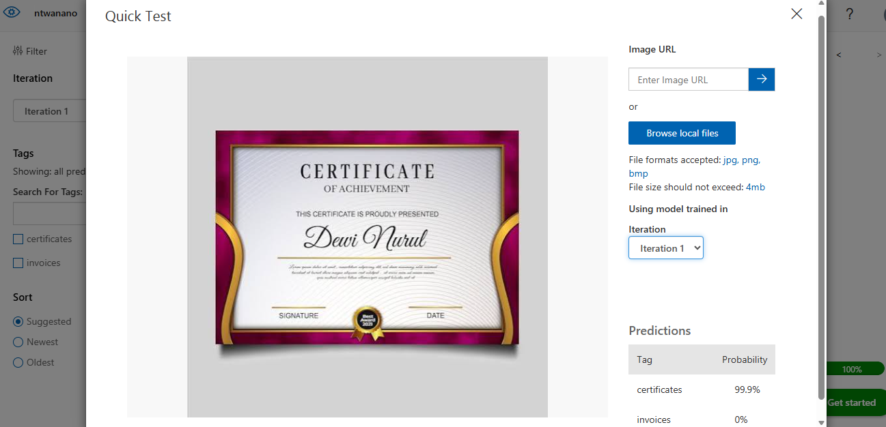
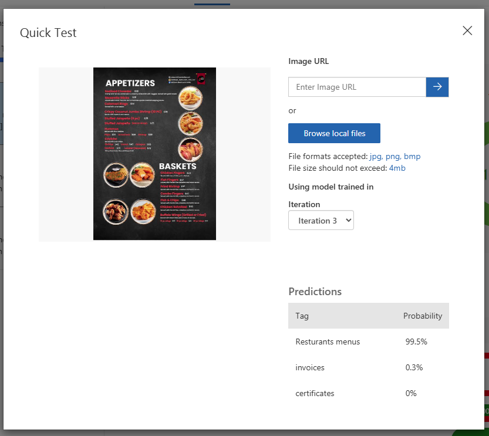

# Exploring Image Classification with Azure Custom Vision

A hands-on walkthrough of building an image classifier using **Azure Custom Vision** — a no-code/low-code service for training your own computer vision models. This one classifies images into categories like invoices, certificates, and restaurant menus, just by showing it labeled examples.

## What you'll need

- An Azure subscription
- A Custom Vision resource (Training + Prediction) created in the Azure Portal
- Access to [customvision.ai](https://www.customvision.ai)

## Step 1 — Create a Custom Vision project

1. Go to [customvision.ai](https://www.customvision.ai) and sign in with your Microsoft account.
2. Click **New Project**.
3. Fill in the project details:
   - **Name:** something descriptive, e.g. `InvoicesAndCertifications`
   - **Description:** a short note on what the model does
   - **Resource:** your Custom Vision Training resource
   - **Project Types:** Classification
   - **Classification Types:** Multiclass (Single tag per image)
   - **Domains:** General [A2]
4. Click **Create project**.



## Step 2 — Gather training images

You need a decent number of images per category (roughly 15–25 works well for a quick demo model). Google Images with a filetype filter is a fast way to gather a variety of samples:

```
invoice sample filetype:jpg
certificate sample filetype:jpg
restaurant menu filetype:jpg
```



## Step 3 — Upload and tag images

1. Go to the **Training Images** tab.
2. Click **Add images** and upload a batch for one category at a time.



3. After uploading, select the images and click **Tag images** to assign the correct label (e.g. `invoices`, `certificates`, `restaurant menus`).
4. Check the **Untagged** filter on the left sidebar — anything left there still needs a tag.
5. Switch to **Tagged** to confirm your counts per category.



One nice thing about Custom Vision: you're not locked into your categories upfront. Starting with two tags and adding a third later (like we did here, adding restaurant menus after starting with invoices and certificates) works fine — just retrain afterward so the model picks up the new category.

## Step 4 — Train the model

1. Once your categories are tagged, click the green **Train** button (top right).
2. Choose **Quick Training** when prompted — it's fast and good enough for experimentation.
3. Wait for training to finish (usually a minute or two for a small dataset).

## Step 5 — Check performance

Once training completes, the **Performance** tab shows:
- **Precision** — how many of the predicted tags were correct
- **Recall** — how many of the actual tagged images were correctly identified
- **AP (Average Precision)** — overall ranking quality of predictions

It also breaks results down **per tag**, so you can see if one category is underperforming.



## Step 6 — Quick Test

Click **Quick Test** (top right) and upload a fresh image — ideally one *not* used in training — to see how the model classifies it.

Testing an invoice:



Testing a certificate:



Testing a restaurant menu (the category added later):



## Takeaway

Custom Vision makes it easy to go from "a folder of labeled images" to a working classifier in minutes, with no model architecture or training code to write. It's a good fit for narrow, well-defined categories — and it's flexible enough to expand with new categories mid-project without starting over.
